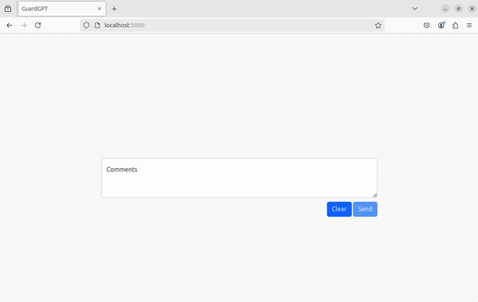

# Why not enter sensitive information into Large Language Models?
With the world being encapsulated with the rise of large language models (LLMs) like ChatGPT, the concerns around user privacy has never been more important.

While  LLMs are extremely useful, it is imperitive the information users feed them isn't sensitive. The primary reason for this is a tale as old as time **Data Breaches**.

Here are some examples of LLMs leaking sensitive information:
* [Slack AI](https://www.theregister.com/2024/08/21/slack_ai_prompt_injection/)
* [AI Call Center](https://www.techradar.com/pro/security/millions-of-conversations-leaked-after-ai-call-center-hacked)
* [WotNot  (Customized Chat Bot Builder)](https://cybernews.com/security/wotnot-exposes-346k-sensitive-customer-files/)
* [ChatGPT](https://www.spiceworks.com/tech/artificial-intelligence/news/chatgpt-leaks-sensitive-user-data-openai-suspects-hack/)

# GuardGPT

This project is a proof of concept for observing and sanitizing user input prior to submitting it to the LLM. Leveraging Microsoft Presidio, the program monitors the user's input in realtime and detects when sensitive personal identifiable information (PII) is entered. If this data is detected, it is anonymized and also prevents the user from submitting the text to the model.

## How it Works
GuardGPT is built using the following technologies:
* Flask 
* SocketIO
* Microsoft Presidio
* Ollama (For the LLM)

The HTML and JavaScript files are hosted locally using Python Flask. SocketIO is used for the creation of web sockets that are used to send the user inputted data back and forth between the server (Flask) and client (Browser). When visiting the webpage, the user is greeted with a textarea to enter their text into. As the user types, their keystrokes are sent to the server where Microsoft Presidio analyzes the text, anonymizes it (if needed) and sends it back to the client and updates the text in the textarea, all of this happens in realtime.

If Microsoft Presidio classifies any of the data being entered as sensitive, it will anonymize it using the format "\<CATEGORY>", where "CATEGORY" is the entity detected (i.e. PERSON, EMAIL, CREDIT_CARD, etc.). If there is anonymized data in the string the user has typed, they will not be able to submit the data to the LLM.

Data from the textarea is being sent to the Ollama LLM that's running locally (instructions for installing Ollama can be found on their official [GitHub](https://github.com/ollama/ollama). The speed in Ollama's responses is dependant on the resources allocated to the model and the computer thats hosting its processing power.

# GuardGPT In Action
Below is an example of GuardGPT in action.



As you can see, as the user types, the text is analyzed on the backend by Microsoft Presidio. If any sensitive information is detected, it is redacted and the "Send" button becomes inactive - this prevents the user from submitting their data to the LLM.

If the user enters a query that doesn't contain any sensitive information - they are allowed to send it to the LLM for analysis.


# Installation


If you would like to install and test this out it can be done quite simply. I recommend installing this in a Linux environment, it was built in one.
1. Clone this reposity and direct yourself to the folder containing the files
    ```
	$ git clone https://github.com/Shmood00/GuardGPT.git
	$ cd GuardGPT/
	```
	
2. Create a virtual environment and install the required Python packages
    ```
	$ python3 -m venv guardgpt
	$ source guardgpt/bin/activate # To activate the virtual environment
	$ pip3 install -r requirements.txt # Install necessary Python packages
	```

3. Modify lines `20` and `24` with your Ollama information.
    ```
	#Line 20
	#Where OLLAMA_URL is the IP Address of the computer hosting the Ollama LLM
	ollama_endpoint = "OLLAMA_URL:11434/api/chat" 
	
	#Line 24
	#Where OLLAMA_MODEL_NAME is the Ollama model you've downloaded, i.e. llama3.2:latest
	chat_data = {
    	"model":"OLLAMA_MODEL_NAME",
    	"messages":[],
    	"stream":False
	}
	```


4. Run the Flask server
    ```
	$ python3 app.py
	```

5. Open your local webbrowser and direct yourself to `http://localhost:5000/`
6. Type someting into the textarea and see what happens!
